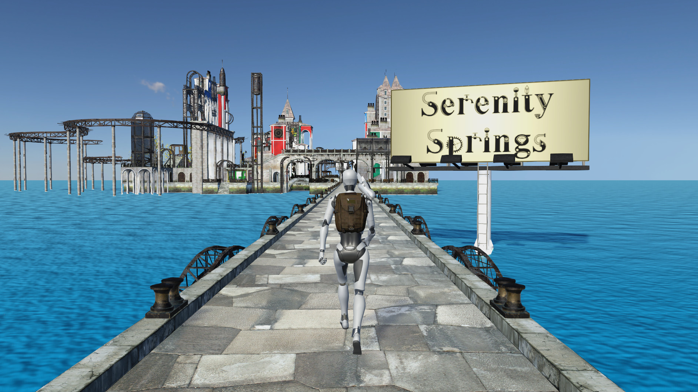

**English version below**\
\
Liebe Studierende, liebe Lehrende, liebe Mitarbeitende,

 
im Rahmen eines Forschungsprojektes der Hochschule Bielefeld (HSBI) in Kooperation mit der
Rheinland-Pfälzischen Technischen Universität Kaiserslautern-Landau (RPTU) wurde das
Computerspiel „Search For Serenity" entwickelt, das nun evaluiert werden soll. Dafür benötigen wir
dringend Studienteilnehmer und -teilnehmerinnen, die unser Spiel ausprobieren.
Bei dem Spiel „Search For Serenity" handelt es sich um ein 3D-Spiel, welches in einer futuristischen,
postapokalyptischen Welt spielt. Das Spiel enthält sechs Spielelemente, die wahlweise gespielt
werden können: 

\
1) Action-Adventure (Bsp. Aliens aus einer geheimen Einrichtung befreien)\
2) Crafting (Bsp. ein Windrad bauen)\
3) Exploration (Bsp. einen entlaufenden Hund in einer Cybercity suchen)\
4) Plattformer (Bsp. Hindernisparcours mit bewegenden Plattformen, fliegenden Autos, Tornados,etc.)\
5) Ressourcen sammeln (Bsp. Blitze auf einem Berg einsammeln)\
6) Racing (Bsp. Autorennen auf einer tropischen Insel)\

 
Ihr Aufgabe besteht darin nur die Level zu spielen, auf die Sie auch wirklich Lust haben! Deswegen
kann ein Durchlauf des Computerspiels zwischen 30 Minuten und maximal 5 Stunden dauern. Das
Spiel muss auch nicht in einem Stück gespielt werden, da der Fortschritt automatisch gespeichert
wird.

\
Grundvoraussetzung zur Teilnahme an der Evaluation:
- 18 bis 70 Jahre alt
- Ein Windows-, Linux- oder Mac-Computer
- Internetverbindung
- Computermaus (kein Touchpad und keine Apple Magic Mouse) oder Gamepad\
\
Wir bitten Sie, folgende Schritte durchzuführen:\
1) Herunterladen des Spiels
  - Es handelt sich hierbei um eine 10 GB ZIP-Datei.
  - Link zur Windows-Variante: [https://ifm.fh-bielefeld.de/cgti/SearchForSerenityWindows.zip](https://ifm.fh-bielefeld.de/cgti/SearchForSerenityWindows.zip)
  - Link zur Mac-Variante: [https://ifm.fh-bielefeld.de/cgti/SearchForSerenityMac.zip](https://ifm.fh-bielefeld.de/cgti/SearchForSerenityMac.zip)
  - Link zur Linux-Variante: [https://ifm.fh-bielefeld.de/cgti/SearchForSerenityLinux.zip](https://ifm.fh-bielefeld.de/cgti/SearchForSerenityLinux.zip)
2) Entpacken der ZIP-Datei
  - Der Vorgang des Entpackens kann bis zu 15 Minuten dauern. Der entpackte Ordner hat eine Größe von 22 GB.
3) Starten des Spiels
  - Windows: Doppelklick auf die „SearchForSerenity.exe"
    -> Ggf. blockiert Windows Defender das Spiel. Falls ein solches Popup erscheint, müssen Sie auf den Text „Weitere Informationen" klicken und anschließend auf den Button „Trotzdem ausführen".
  - Mac: Doppelklick auf das entpackte Programm „SearchForSerenityMac"
    -> Das anschließende Scannen des Spiels kann mehrere Minuten dauern.
    -> Führen Sie folgende Schritte aus, falls sich das Spiel nach dem Scannen nicht öffnet:
        a) Öffnen Sie den Finder-Ordner, in dem sich das Spiel befindet.
        b) Falls es keine Pfadleiste am unteren Rand des Finder-Fensters gibt, klicken Sie auf „Darstellung" und anschließend auf „Pfadleiste einblenden".
        c) Klicken sie mit Rechtsklick auf den aktuellen Ordner in der Pfadleiste (oder mittels Linksklick und gedrückter „ctrl" Taste) und wählen Sie „In Terminal öffnen" aus.
        d) Geben Sie folgenden Befehl im Terminal-Fenster ein und drücken sie die Enter-Taste (bzw. Return-Taste oder Zeilenschalter): xattr -rc *.app
        e) Machen Sie erneut einen Doppelklick auf das Spiel.
          - Nach dem Starten des Spiels werden Sie per Popup gefragt, ob das Spiel auf Ihre Ordner und Dateien zugreifen darf. Dieses bitte erlauben, da sonst keine Messdaten abgespeichert werden können.
  - Linux: Doppelklick auf „SearchForSerenity.x86_64"
4) Ausfüllen des Prätest-Fragebogens
  - Die Umfrage wird am Anfang des Spiels aus dem Spiel heraus geöffnet.
5) Spielen des Computerspiels
  - Bitte nur die Level spielen, auf die Sie Lust haben!
  - Nach jedem Level wird automatisch gespeichert, weswegen Sie auch Pausen einlegen können.
  - Bitte vermeiden Sie eine längere Pause einzulegen, ohne das Pause-Menü zu öffnen oder das Computerspiel zu schließen. Sie können das Computerspiel nach Ihrer Pause durch Neustart oder durch Schließen des Pause-Menüs fortsetzen.
  - Falls es Performance-Probleme gibt, können Sie in den Einstellungen die Auflösung oder das Quality-Level heruntersetzen.
6) Ausfüllen des Posttest-Fragebogens
  - Die Umfrage wird am Ende des Spiels aus dem Spiel heraus geöffnet.
  \
  \
Vielen Dank für Ihre Unterstützung. Wenn Sie Fragen zum Projekt haben können Sie uns gerne unter kerstin.mueller@hsbi.de kontaktieren.\
Mit freundlichen Grüßen,\
Kerstin Müller, Lennart Dümke, Yannic Döll\
\
==================================================================================\
English Version:\
Dear students, dear lecturers, dear employees,\
As part of a research project at Hochschule Bielefeld (HSBI) in cooperation with the Rheinland-\
Pfälzischen Technischen Universität Kaiserslautern-Landau (RPTU), the computer game "Search For\
Serenity" has been developed and is now to be evaluated. To do this, we urgently need study\
participants to try out our game.\
The game "Search For Serenity" is a 3D game set in a futuristic, post-apocalyptic world. The game\
contains six game elements that can be played as desired:\
1\. Action-adventure (e.g. freeing aliens from a secret facility)\
2\. Crafting (e.g. building a wind turbine)\
3\. Exploration (e.g. searching for an escaped dog in a cybercity)\
4\. Platforms (e.g. obstacle course with moving platforms, flying cars, tornadoes, etc.)\
5\. Resource harvesting (e.g. collecting lightning on a mountain)\
6\. Racing (e.g. car racing on a tropical island)\
Your task is to only play the levels that you really want to play! That is why one run of the computer\
game can take between 30 minutes and a maximum of 5 hours. The game does not have to be played\
in one go, as progress is saved automatically.\
Basic requirement for participation in the evaluation:\
- 18 to 70 years old\
- A Windows, Linux or Mac computer\
- Internet connection\
- Computer mouse (no touchpad and no Apple Magic Mouse) or gamepad\
Please carry out the following steps:\
1\. Download the game\
- This is a 10 GB ZIP file.\
- Link to the Windows version: https://ifm.fh-bielefeld.de/cgti/SearchForSerenityWindows.zip\
- Link to the Mac version: https://ifm.fh-bielefeld.de/cgti/SearchForSerenityMac.zip\
- Link to the Linux version: https://ifm.fh-bielefeld.de/cgti/SearchForSerenityLinux.zip\
2\. Unpacking the ZIP file\
- The unpacking process can take up to 15 minutes. The unzipped folder has a size of 22 GB.\
3\. Start the game\
- Windows: Double-click on the "SearchForSerenity.exe".\
o Windows Defender may be blocking the game. If such a pop-up appears, you must\
click on the text "More info" and then on the button "Run anyway".\
- Mac: Double-click on the unzipped program "SearchForSerenityMac"\
o The subsequent scanning of the game may take several minutes.\
o Carry out the following steps if the game does not open after scanning:\
- a) Open the Finder folder in which the game is located.\
- b) If there is no path bar at the bottom of the Finder window, click on "View"\
and then on "Show Path Bar".\
- c) Right-click on the current folder in the path bar (or left-click while holding\
down the "ctrl" key) and select "Open in Terminal".\
- d) Enter the following command in the terminal window and press the Enter\
key (or Return key): xattr -rc *.app\
- e) Double-click on the game again.\
o After starting the game, you will be asked in a pop-up whether the game is allowed to\
access your folders and files. Please allow this, otherwise no measurement data can\
be saved.\
- Linux: Double-click on "SearchForSerenity.x86_64"\
4\. Filling out the pre-test questionnaire\
- The survey will be opened at the beginning of the game from within the game.\
5\. Playing the computer game\
- Please only play the levels you want to play!\
- The game saves automatically after each level, so you can also take breaks.\
- Please avoid taking a longer break without opening the pause menu or closing the computer\
game. You can resume the computer game after your break by restarting it or by closing the\
pause menu.\
- If there are performance problems, you can reduce the resolution or the quality level in the\
settings.\
6\. Filling out the posttest questionnaire\
- The survey will be opened at the end of the game from within the game.\
Thank you for your support. If you have any questions about the project, please feel free to contact\
us at kerstin.mueller@hsbi.de.\
Yours sincerely,\
Kerstin Müller, Lennart Dümke, Yannic Döll
